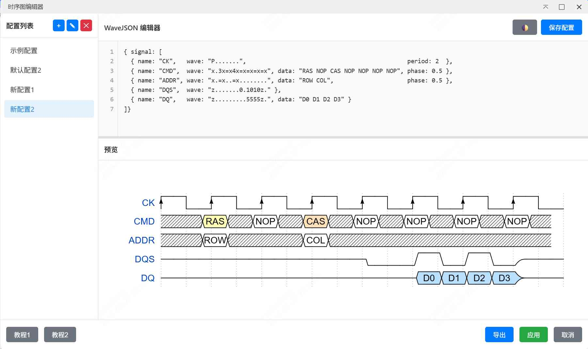
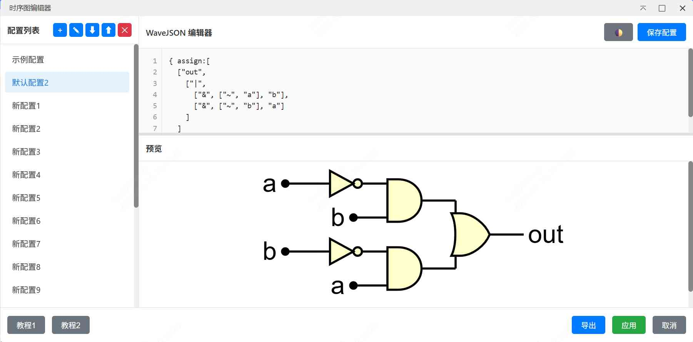
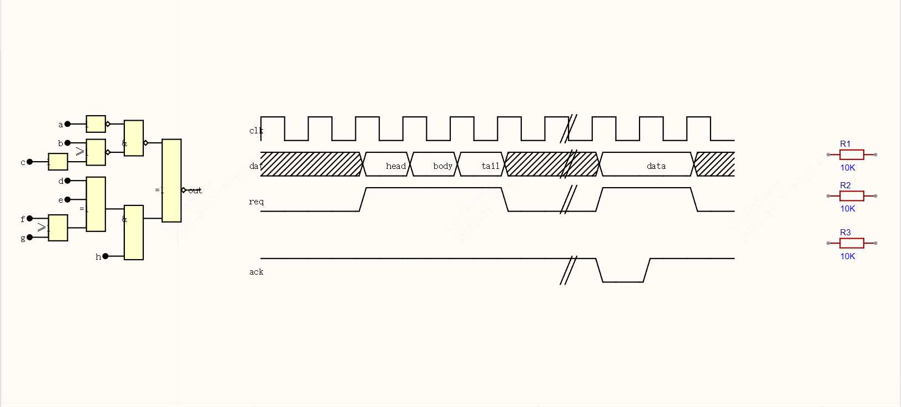

[中文](./README.md)

# Timing Diagram Tool

A timing diagram tool based on WaveDrom, supporting creation and placement of professional digital timing diagrams in EasyEDA Pro schematics.

Timing diagram support:



Logic gate support:



Effect in schematic:



## Features

- ✨ **Real-time Preview** - Generate timing diagram preview in real-time while editing WaveJSON syntax
- 📝 **Configuration Management** - Save, load, rename, and delete multiple timing diagram configurations
- 💾 **Import/Export** - Import and export configuration files for backup and sharing
- 🎨 **Theme Toggle** - Support light/dark editor themes
- 📏 **Line Numbers** - Code editor with line numbers for easy navigation
- 🌐 **Multi-language** - Support Chinese and English interfaces
- 📤 **SVG Export** - Export timing diagrams as SVG files
- 🔧 **Adjustable Layout** - Drag separator to adjust editor and preview area heights

## Known Issue

- The text insertion has a slight offset, which will be corrected after the subsequent API is fixed

## Installation

1. Open **EasyEDA Pro** or download the latest `.eext` file
2. In **EasyEDA Pro**, click **Advanced** → **Extension Manager** → **Extension List**
3. Find **Timing Diagram Tool** and click install, or click **Import Extension** button
4. Select the downloaded `.eext` file
5. Confirm installation

## Usage

### Open Editor

1. In schematic editor, click top menu **Timing Diagram Tool** → **Draw Timing Diagram...**
2. Editor window will open

### Edit Timing Diagram

1. Select or create a configuration on the left
2. Enter WaveJSON syntax in the middle editor
3. Preview area will show the generated timing diagram in real-time
4. Click **Save Config** to save current configuration

### WaveJSON Syntax

Example 1 - Basic Timing Diagram:

```json
{ "signal": [
  { "name": "clk",  "wave": "p.....|..." },
  { "name": "dat",  "wave": "x.345x|=.x", "data": ["head", "body", "tail", "data"] },
  { "name": "req",  "wave": "0.1..0|1.0" },
  {},
  { "name": "ack",  "wave": "1.....|01." }
]}
```

Example 2 - Logic Gate:

```json
{ assign:[
  ["out",
    ["|",
      ["&", ["~", "a"], "b"],
      ["&", ["~", "b"], "a"]
    ]
  ]
]}
```

For more syntax, refer to WaveDrom official tutorials:
- [Tutorial 1](https://wavedrom.com/tutorial.html)
- [Tutorial 2](https://wavedrom.com/tutorial2.html)

### Configuration Import/Export

- **Export Config** - Click ⬆ button to export all configurations to JSON file, filename format: `timing-configs_{date}.json`
- **Import Config** - Click ⬇ button to import configurations from JSON file (will overwrite all current configurations)

Configuration file format:
```json
{
  "version": "1.0.0",
  "exportDate": "2026-03-28T00:00:00.000Z",
  "appName": "Timing Diagram Tool",
  "configs": [
    {
      "id": "...",
      "name": "Config Name",
      "wavejson": "{ signal: [...] }",
      "createdAt": 1234567890,
      "updatedAt": 1234567890
    }
  ]
}
```

### Export and Apply

- **Export SVG** - Export timing diagram as SVG file, filename format: `Timing_{schematic_name}_{date}.svg`
- **Apply** - Convert timing diagram to lines and text and place into schematic, all elements will be auto-selected, use Ctrl+G to group

## Shortcuts

- **Theme Toggle** - Click 🌓 button to toggle light/dark editor theme
- **Drag to Resize** - Drag separator between editor and preview to adjust height
- **Config Management** - Use +, ✎, ✕ buttons in left toolbar to manage configurations

## Tech Stack

- **WaveDrom** - Timing diagram rendering engine
- **EasyEDA Pro API** - Extension development API
- **Vanilla JavaScript** - No framework dependencies

## Development

```bash
# Install dependencies
npm install

# Compile
npm run compile

# Build extension package
npm run build
```

Built `.eext` file is located in `build/dist/` directory.

## License

MIT License

## Contributing

Issues and Pull Requests are welcome!

## Links

- [EasyEDA Pro](https://pro.easyeda.com/)
- [WaveDrom](https://wavedrom.com/)
- [EasyEDA Pro Extension Development Docs](https://prodocs.easyeda.com/)
